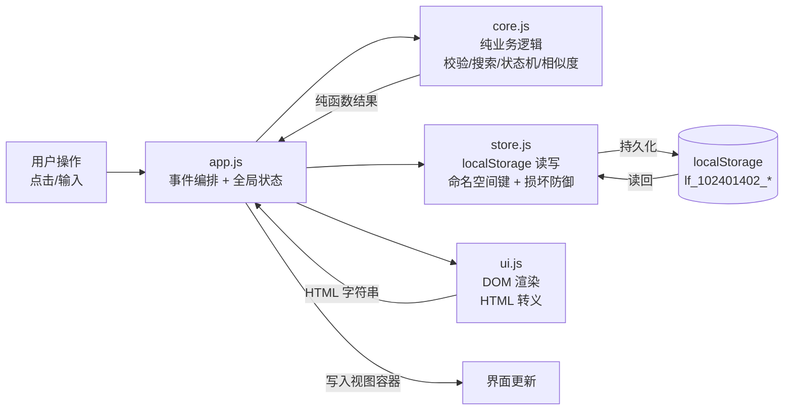
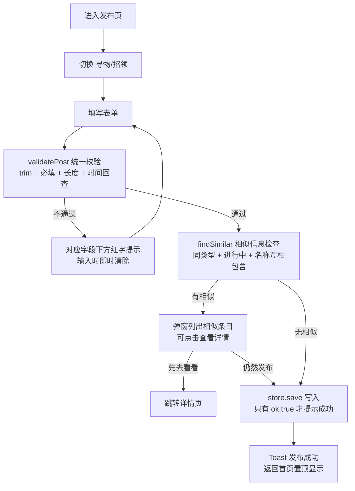
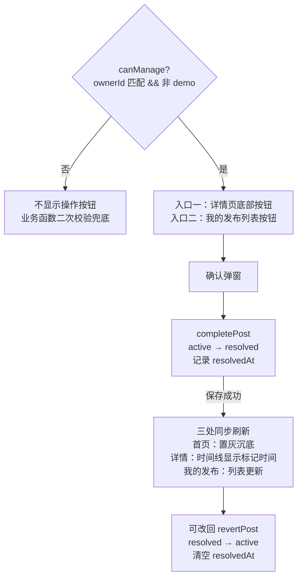
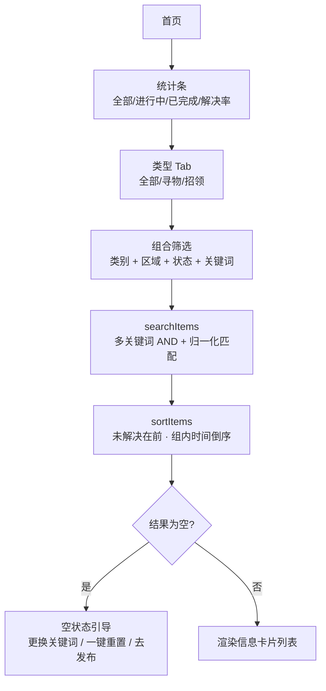

# 数据流图与关键流程图（Mermaid 版）

> 博客正文使用绘制后的图片版；本文件为可维护的 Mermaid 源码。

## 一、系统数据流图

```mermaid
flowchart LR
  U[用户操作<br/>点击/输入] --> A[app.js<br/>事件编排 + 全局状态]
  A --> C[core.js<br/>纯业务逻辑<br/>校验/搜索/状态机/相似度]
  A --> S[store.js<br/>localStorage 读写<br/>命名空间键 + 损坏防御]
  A --> R[ui.js<br/>DOM 渲染<br/>HTML 转义]
  S -->|持久化| LS[(localStorage<br/>lf_102401402_*)]
  LS -->|读回| S
  C -->|纯函数结果| A
  R -->|HTML 字符串| A
  A -->|写入视图容器| V[界面更新]
```

## 二、发布信息流程

```mermaid
flowchart TD
  Start[进入发布页] --> T[切换 寻物/招领]
  T --> F[填写表单]
  F --> V[validatePost 统一校验<br/>trim + 必填 + 长度 + 时间回查]
  V -->|不通过| E[对应字段下方红字提示<br/>输入时即时清除]
  E --> F
  V -->|通过| Sim[findSimilar 相似信息检查<br/>同类型 + 进行中 + 名称互相包含]
  Sim -->|有相似| DLG[弹窗列出相似条目<br/>可点击查看详情]
  DLG -->|先去看看| D[跳转详情页]
  DLG -->|仍然发布| Save[store.save 写入<br/>只有 ok:true 才提示成功]
  Sim -->|无相似| Save
  Save --> OK[Toast 发布成功<br/>返回首页置顶显示]
```

## 三、状态更新流程（状态闭环）

```mermaid
flowchart TD
  Q{canManage?<br/>ownerId 匹配 && 非 demo} -->|否| NO[不显示操作按钮<br/>业务函数二次校验兜底]
  Q -->|是| ENTRY[入口一：详情页底部按钮<br/>入口二：我的发布列表按钮]
  ENTRY --> CONFIRM[确认弹窗]
  CONFIRM --> COMP[completePost<br/>active → resolved<br/>记录 resolvedAt]
  COMP -->|保存成功| SYNC[三处同步刷新<br/>首页：置灰沉底<br/>详情：时间线显示标记时间<br/>我的发布：列表更新]
  SYNC --> REV[可改回 revertPost<br/>resolved → active<br/>清空 resolvedAt]
```

## 四、浏览与搜索流程

```mermaid
flowchart TD
  Start[首页] --> Stats[统计条<br/>全部/进行中/已完成/解决率]
  Stats --> Tab[类型 Tab<br/>全部/寻物/招领]
  Tab --> Filter[组合筛选<br/>类别 + 区域 + 状态 + 关键词]
  Filter --> Search[searchItems<br/>多关键词 AND + 归一化匹配]
  Search --> Sort[sortItems<br/>未解决在前 · 组内时间倒序]
  Sort --> Check{结果为空?}
  Check -->|是| Empty[空状态引导<br/>更换关键词 / 一键重置 / 去发布]
  Check -->|否| List[渲染信息卡片列表]
```
